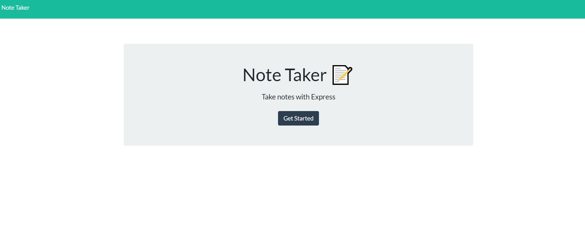
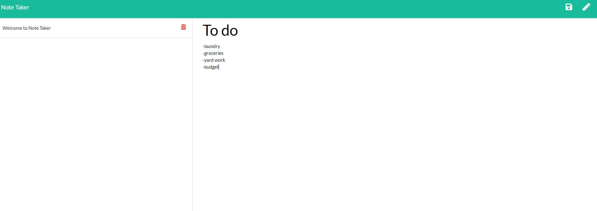

# Note Taker

  

  ## Description 
  
  Note Taker is an app that lets a user write, save, and delete notes. To add a note, click the pencil icon in the top right corner of the screen. When the title and the text body of the note have been fill, clicking the save button will keep the note in the left column of the screen. To preview any of the previous notes, simply click on the title of the note and the note will be visible on the right column. To remove a note from the saved notes, click the trash can icon next to the note. This application uses an Express.js back end to save and retieve note data from a JSON file. 
  
  
  
  
  ## Table of Contents
  
  * [Installation](#installation)
  * [Usage](#usage)
  * [Credits](#credits)
  * [License](#license)
  

  ## Installation
  
  No need to install the project. It is available at https://vast-citadel-37246.herokuapp.com/
  
  ## Usage 

  Navigate to the landing page of the website and click get started. From there, a user can write/save/delete notes as outlined in the description of this project.
  
  ## Credits
  
  Xander Rapstine contributed the starter code. Link to their github profile: https://github.com/Xandromus
   
  ## License

  Apache

  ## Questions
  If you run into any errors or have further questions about this program, you can contact me here: 

  -github: https://github.com/parkerrobison 

  -email: parkerobison@gmail.com.

  Please reference the project in question in the message. Thank you.
